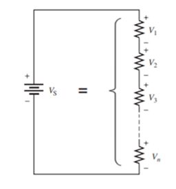
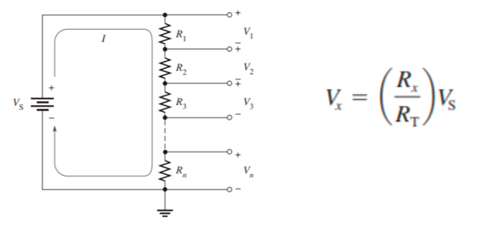
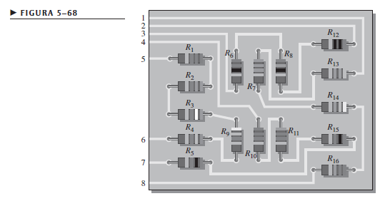
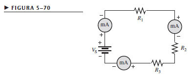
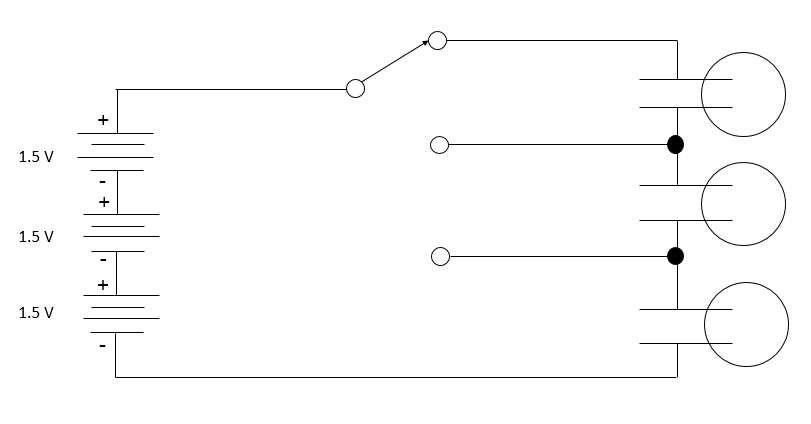
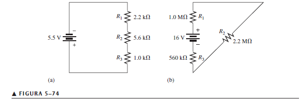
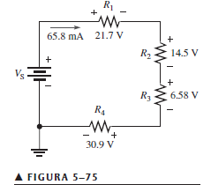
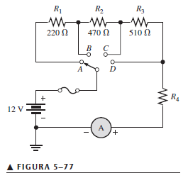
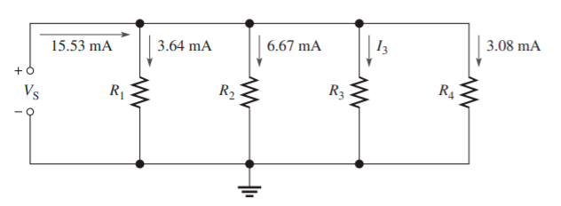

# INFORME-TAREA-3

1) OBJETIVOS:
Objetivo General: Analizar los circuitos en Serie y en Paralelo, mediante el uso de diferentes leyes aplicables para los circuitos, para lograr establecer semejanzas y diferencias durante la resolución de problemas.

Objetivos específicos:

-	Analizar los circuitos en serie, aplicando la Ley de Ohm y la Ley de Voltajes de Kirchhoff.
-	Analizar los circuitos en Paralelo, aplicando la Ley de Ohm y la Ley de Corrientes de Kirchhoff
-	Analizar las fallas que se pueden presentar en los circuitos en serie y paralelo, siguiendo el algoritmo de solución correctamente.

2) Marco Teorico

Resistores en serie
Una resistencia esta conectada a continuación de la otra. 

Recuerde que, si entre dos puntos existe sólo una trayectoria para la corriente, los resistores ubicados entre esos dos puntos están en serie, no importa cómo aparezcan en un diagrama.
Corriente en un circuito en serie
Forman una “hilera” en la cual existe sólo una trayectoria para la corriente
Un circuito en serie proporciona sólo una trayectoria para el paso de la corriente entre dos puntos, de modo que la corriente es la misma a través de cada resistor en serie.
Resistencia total en serie
Cuando los resistores se conectan en serie, sus valores se suman porque cada resistor ofrece oposición a la corriente en proporción directa a su resistencia. Un mayor número de resistores conectados se opone más a la corriente. Más oposición a la corriente implica un valor más alto de resistencia. Por tanto, cada vez que un resistor se agrega en serie, la resistencia total aumenta.
RT = R1 + R2 + R3 + …. + Rn
Aplicación de la ley de Ohm
La polaridad de una caída de voltaje entre los extremos de un resistor es positiva en el extremo del resistor que está más cercano a la terminal positiva de la fuente de voltaje.
Se define que la corriente a través de un resistor circula en la dirección que va del extremo positivo del resistor al extremo negativo.

Fuentes de voltaje en serie
Cuando dos o más fuentes de voltaje están en serie, el voltaje total es igual a la suma algebraica de los voltajes de fuente individuales.
 
 
 
Cuando todas las fuentes de voltaje están en la misma dirección en cuanto a sus polaridades
VAB = 1.5 V + 1.5 V + 1.5 V = +4.5 V
La fuente intermedia se opone a las fuentes; tiene un signo opuesto cuando se suman
VAB = +1.5 V - 1.5 V + 1.5 V = +1.5 V
Ley del voltaje de Kirchhoff
la suma algebraica de todos los voltajes localizados en una sola trayectoria cerrada es cero o, en otras palabras, que la suma de las caídas de voltaje es igual al voltaje de fuente total.
VS = V1 + V2 + V3 + …. + VN
 

Divisores de voltaje
Un circuito compuesto a partir de una serie de resistores conectada a una fuente de voltaje actúa como divisor de voltaje

Potencia en circuitos en serie
La cantidad total de potencia presente en un circuito resistivo dispuesto en serie es igual a la suma de potencias de cada resistor en serie.
PT = P1 + P2 + P3 + … + Pn
Como existe la misma corriente a través de cada resistor dispuesto en serie, se utilizan las fórmulas
 
Mediciones de voltaje
El voltaje es la suma de todos los voltajes en los componentes.
VT=V1+V2+V3+…+Vn

CIRCUITOS EN PARALELO
Resistores en paralelo
Todos los puntos ubicados a lo largo de la parte superior en gris son, eléctricamente, el mismo punto que el punto A, y todos los puntos localizados a lo largo de la parte inferior son, eléctricamente, el mismo punto que el punto B.
 
 
 
Voltaje en un circuito en paralelo 
El voltaje es el mismo en cualquier componente conectado en paralelo. 
V1 = V2 = V3 = V4 = V5=Vn = Vs
Ley de las corrientes de Kirchhoff 
Cada trayectoria para la corriente se denomina rama, y un circuito en paralelo es uno que tiene más de una rama.
IT = I1 + I2 + I3 + In
 

Resistencia total en paralelo 
La resistencia total del circuito es igual a la inversa de la suma de las inversas de las resistencias que hay en el circuito
 
Fuentes de corriente en paralelo 
La corriente total producida por fuentes de corriente en paralelo es igual a la suma algebraica de las fuentes de corriente individuales. La suma algebraica implica que se debe considerar la dirección de la corriente cuando se combinan las fuentes en paralelo.
 
 
IT = 1 A + 2 A + 2 A = 5 A
IT = 2 A + 2 A - 1 A = 3 A
Divisores de corriente 
la corriente total dirigida hacia la unión de las ramas dispuestas en paralelo se divide entre las ramas. Por tanto, un circuito en paralelo actúa como divisor de corriente.
Entre los resistores en paralelo, la corriente total se divide en corrientes con valores que son inversamente proporcionales a los valores de resistencia.
 
Potencia en circuitos en paralelo
Fórmula para determinar la potencia total en una forma concisa para cualquier cantidad de resistores dispuestos en paralelo.
PT = P1 + P2 + P3 + … + Pn
para calcular la potencia total:
 

3)Explicacion y resolucion de ejercicios.

SECCIÓN 5–1 Resistores en serie
1. Conecte en serie cada juego de resistores mostrado en la figura 5-67 entre los puntos A y B.
 

3. Determine la resistencia nominal presente entre las puntas 1 y 8 del circuito de la figura 5-68.
 
R_T=R_13+R_7+R_14+R_16
R_T=170Ω
Esto es porque todas las resistencias están conectadas en serie, es decir, que sus terminales están conectados uno a continuación del otro.

5. En la tarjeta de circuito impreso de doble cara mostrada en la figura 5-69, identifique cada grupo de resistores
en serie. Observe que muchas de las interconexiones de la tarjeta van de la cara anterior a la
cara posterior.
 

SECCIÓN 5–2 Corriente en un circuito en serie
7. La corriente suministrada por la fuente en la figura 5-70 es de 5 mA ¿Cuánta corriente indica cada miliamperímetro
localizado en el circuito?

Muestra un valor de 5mA, porque están colocados en la dirección correcta en la cual avanzan los electrones.

9. Con baterías de 1.5 V, un interruptor, y tres lámparas, disponga un circuito para aplicar 4.5 V a través
de cualquier lámpara, de dos lámparas en serie, o de tres lámparas en serie con un solo interruptor de
control. Trace el diagrama esquemático.

SECCIÓN 5–3 Resistencia total en serie
11. Encuentre la resistencia total de los siguientes grupos de resistores en serie:
a) 560 Ω y 1000 Ω 
Rt = (560+1000) Ω =1560 Ω
b) 47 Ω y 56 Ω
Rt = (47+56) Ω = 103 Ω
c) 1.5k Ω, 2.2k Ω, y 10 kΩ
Rt = (1.5+2.2+10) Ω = 13.7Ω
d) 1 MΩ, 470 k Ω, 1k Ω y 2.2 M Ω
Rt = (1000 +470+1+2200) kΩ = 3671 k Ω

13. ¿Cuál es la resistencia total de doce resistores de 5.6 k Ω dispuestos en serie?
Rt = 12(5.6 k Ω)=67.2 k Ω
15. Si en la figura 5-72 la resistencia total es de 17.4 k Ω, ¿cuál es el valor de R5?

Rt = R1+R2+R3+R4+R5
17.4 k Ω = 5.6 k Ω + 1 k Ω + 2.2 k Ω + 4.7 k Ω + R5
R5 = (17.4-5.6-1-2.2-4.7) k Ω
R5 = 3.9 k Ω
17. En la figura 5-71, encuentre la resistencia total si los tres circuitos están conectados en serie.

Rt = (1+5.6+2.2+0.0047+0.01+0.012+0.001+1000+560+5600+680+10000) k Ω
Rt= 17848.82 k Ω
SECCIÓN 5–4 Aplicación de la ley de Ohm
19. ¿Cuál es la corriente presente en cada circuito de la figura 5-74?

a) I=V/Rt=(5.5 V)/(2.2+5.6+1)KΩ=0.625 mA
b) I=V/Rt=(16 V)/(1000+2200+560)KΩ=4.25*10^(-6)  A=4.25 uA

21. Se conectan tres resistores de 470 Ω en serie con una fuente de 48 V.
(a) ¿Cuál es la corriente en el circuito?
(b) ¿Cuál es el voltaje a través de cada resistor?
(c) ¿Cuál es el valor nominal de potencia de los resistores?
a) I=V/Rt=(48 V)/(3*470Ω)=0.034 A
b) V=I*R=0.034 A*470 Ω=16 V 
c) P=〖Vs〗^2/Rt=〖(48 V)〗^2/1410Ω=1.63 W

23. ¿Cuál es el valor de cada resistor mostrado en la figura 5-75?

R1=(21.7 V)/(65.8 mA)=329.78 Ω
R2=(14.5 V)/(65.8 mA)=220.36 Ω
R3=(6.58 V)/(65.8 mA)=100 Ω
R4=(30.9 V)/(65.8 mA)=469.6 Ω 
25. En el circuito de la figura 5-77, el medidor lee 7.84 mA cuando el interruptor está en la posición A.
(a) ¿Cuál es la resistencia de R4?
(b) ¿Cuál deberá ser la lectura del medidor en las posiciones B, C y D del interruptor?
(c) ¿Se fundirá un fusible de 1⁄4 A en cualquier posición del interruptor?

a) R4=Rt-R1-R2-R3
R4=(12 V)/(7.84 mA)-220Ω-470Ω-510Ω
R4=330.61 Ω
b) IB=(12 V)/(470 Ω +510 Ω+330.61 Ω)=9.15 mA
IC=(12 V)/(510 Ω+330.61 Ω)=14.27 mA
ID=(12 V)/(330.61 Ω)=36.29 Ω
c) No, el fusible no se fundirá en el recorrido A

SECCIÓN 5–5 Fuentes de voltaje en serie
27. Ayuda en serie es un término utilizado en ocasiones para describir fuentes de voltaje de la misma polaridad
en serie. Si una fuente de 5 V y otra de 9 V están conectadas de esta manera, ¿cuál es el voltaje
total?
Vt = 5 V+9 V = 14 V

29. Determine el voltaje de fuente total en cada circuito de la figura 5-79.

a) Las fuentes están conectadas hacia la misma polaridad,por lo tanto:
Vt=(10+5+8)V=23 V
b) La fuente de 25 V está conectada hacia polaridad diferente,por lo tanto:
Vt=(25-10-50)V=-35 V
c) Las dos fuentes proveen el mismo voltaje y están conectadas hacia diferente polaridad,por lo tanto,
el Voltaje es igual a 0 
31. Cinco resistores están dispuestos en serie con una fuente de 20 V. Las caídas de voltaje a través de cuatro
de los resistores son: 1.5 V, 5.5 V, 3 V, y 6 V. ¿Cuál es la caída de voltaje en el quinto resistor?
Vt=V1+V2+V3+V4+V5
V5=Vt-V1-V2-V3-V4
V5=(20-1.5-5.5-3-6)V=4V
33. En el circuito de la figura 5-81, determine la resistencia de R4.

(5.4 V)/(27 )=(4.4 V)/R4
R4=(27Ω*4.4 V)/(5.4 V)=22 Ω
35. Determine el voltaje a través de R5 para cada una de las posiciones del interruptor de la figura 5-83. La
corriente en cada posición es como sigue: A, 3.35 mA; B, 3.73 mA; C, 4.50 mA; D, 6.00 mA.

3.35 mA=(18 V)/(1800+1000+820+560+R5)Ω
3.35*10^(-3)  (4180)+3.35R5=18V
3.35*10^(-3)  R5=4
R5=1.19 KΩ

VA=3.35*10^(-3) A*1.19KΩ
VA=4 V
VB=3.73*10^(-3) A*1.19KΩ
VB=4.45 V
VC=4.5*10^(-3) A*1.19KΩ
VC=5.37 V
VD=6*10^(-3) A*1.19 KΩ
VD=7.16 V

37. La resistencia total de un circuito es de 560 Ω. ¿Qué porcentaje del voltaje total aparece a través de un
resistor de 27 Ω que forma parte de la resistencia total en serie?
V_x=(R_x/R_T ) V_T=((27 Ω)/(560 Ω)) V_T
V_T/(27/560 Vt)=(100%)/x
x=(27*100%)/560=4.82%

4)Video

5)Conclusiones

6)Bibliografia

