# INFORME-TAREA-3

1) OBJETIVOS:
Objetivo General: Analizar los circuitos en Serie y en Paralelo, mediante el uso de diferentes leyes aplicables para los circuitos, para lograr establecer semejanzas y diferencias durante la resolución de problemas.

Objetivos específicos:

-	Analizar los circuitos en serie, aplicando la Ley de Ohm y la Ley de Voltajes de Kirchhoff.
-	Analizar los circuitos en Paralelo, aplicando la Ley de Ohm y la Ley de Corrientes de Kirchhoff
-	Analizar las fallas que se pueden presentar en los circuitos en serie y paralelo, siguiendo el algoritmo de solución correctamente.

2) Marco Teorico

Resistores en serie
Una resistencia esta conectada a continuación de la otra. 

Recuerde que, si entre dos puntos existe sólo una trayectoria para la corriente, los resistores ubicados entre esos dos puntos están en serie, no importa cómo aparezcan en un diagrama.
Corriente en un circuito en serie
Forman una “hilera” en la cual existe sólo una trayectoria para la corriente
Un circuito en serie proporciona sólo una trayectoria para el paso de la corriente entre dos puntos, de modo que la corriente es la misma a través de cada resistor en serie.
Resistencia total en serie
Cuando los resistores se conectan en serie, sus valores se suman porque cada resistor ofrece oposición a la corriente en proporción directa a su resistencia. Un mayor número de resistores conectados se opone más a la corriente. Más oposición a la corriente implica un valor más alto de resistencia. Por tanto, cada vez que un resistor se agrega en serie, la resistencia total aumenta.
RT = R1 + R2 + R3 + …. + Rn
Aplicación de la ley de Ohm
La polaridad de una caída de voltaje entre los extremos de un resistor es positiva en el extremo del resistor que está más cercano a la terminal positiva de la fuente de voltaje.
Se define que la corriente a través de un resistor circula en la dirección que va del extremo positivo del resistor al extremo negativo.

Fuentes de voltaje en serie
Cuando dos o más fuentes de voltaje están en serie, el voltaje total es igual a la suma algebraica de los voltajes de fuente individuales.
 
 
 
Cuando todas las fuentes de voltaje están en la misma dirección en cuanto a sus polaridades
VAB = 1.5 V + 1.5 V + 1.5 V = +4.5 V
La fuente intermedia se opone a las fuentes; tiene un signo opuesto cuando se suman
VAB = +1.5 V - 1.5 V + 1.5 V = +1.5 V
Ley del voltaje de Kirchhoff
la suma algebraica de todos los voltajes localizados en una sola trayectoria cerrada es cero o, en otras palabras, que la suma de las caídas de voltaje es igual al voltaje de fuente total.
VS = V1 + V2 + V3 + …. + VN
 

Divisores de voltaje
Un circuito compuesto a partir de una serie de resistores conectada a una fuente de voltaje actúa como divisor de voltaje

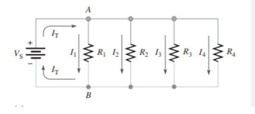

Potencia en circuitos en serie
La cantidad total de potencia presente en un circuito resistivo dispuesto en serie es igual a la suma de potencias de cada resistor en serie.
PT = P1 + P2 + P3 + … + Pn
Como existe la misma corriente a través de cada resistor dispuesto en serie, se utilizan las fórmulas
 
Mediciones de voltaje
El voltaje es la suma de todos los voltajes en los componentes.
VT=V1+V2+V3+…+Vn

CIRCUITOS EN PARALELO
Resistores en paralelo
Todos los puntos ubicados a lo largo de la parte superior en gris son, eléctricamente, el mismo punto que el punto A, y todos los puntos localizados a lo largo de la parte inferior son, eléctricamente, el mismo punto que el punto B.
 
 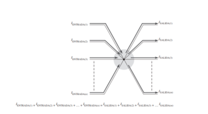
 
Voltaje en un circuito en paralelo 
El voltaje es el mismo en cualquier componente conectado en paralelo. 
V1 = V2 = V3 = V4 = V5=Vn = Vs
Ley de las corrientes de Kirchhoff 
Cada trayectoria para la corriente se denomina rama, y un circuito en paralelo es uno que tiene más de una rama.
IT = I1 + I2 + I3 + In
 

Resistencia total en paralelo 
La resistencia total del circuito es igual a la inversa de la suma de las inversas de las resistencias que hay en el circuito
 
Fuentes de corriente en paralelo 
La corriente total producida por fuentes de corriente en paralelo es igual a la suma algebraica de las fuentes de corriente individuales. La suma algebraica implica que se debe considerar la dirección de la corriente cuando se combinan las fuentes en paralelo.
 
 
IT = 1 A + 2 A + 2 A = 5 A
IT = 2 A + 2 A - 1 A = 3 A
Divisores de corriente 
la corriente total dirigida hacia la unión de las ramas dispuestas en paralelo se divide entre las ramas. Por tanto, un circuito en paralelo actúa como divisor de corriente.
Entre los resistores en paralelo, la corriente total se divide en corrientes con valores que son inversamente proporcionales a los valores de resistencia.
 
Potencia en circuitos en paralelo
Fórmula para determinar la potencia total en una forma concisa para cualquier cantidad de resistores dispuestos en paralelo.
PT = P1 + P2 + P3 + … + Pn
para calcular la potencia total:
 

3)Explicacion y resolucion de ejercicios.

SECCIÓN 5–1 Resistores en serie
1. Conecte en serie cada juego de resistores mostrado en la figura 5-67 entre los puntos A y B.
 

3. Determine la resistencia nominal presente entre las puntas 1 y 8 del circuito de la figura 5-68.
 
R_T=R_13+R_7+R_14+R_16
R_T=170Ω
Esto es porque todas las resistencias están conectadas en serie, es decir, que sus terminales están conectados uno a continuación del otro.

5. En la tarjeta de circuito impreso de doble cara mostrada en la figura 5-69, identifique cada grupo de resistores
en serie. Observe que muchas de las interconexiones de la tarjeta van de la cara anterior a la
cara posterior.
 
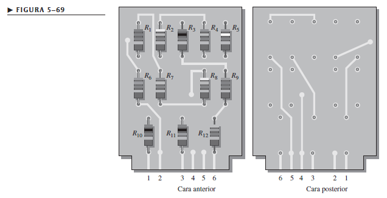

SECCIÓN 5–2 Corriente en un circuito en serie
7. La corriente suministrada por la fuente en la figura 5-70 es de 5 mA ¿Cuánta corriente indica cada miliamperímetro
localizado en el circuito?

Muestra un valor de 5mA, porque están colocados en la dirección correcta en la cual avanzan los electrones.

9. Con baterías de 1.5 V, un interruptor, y tres lámparas, disponga un circuito para aplicar 4.5 V a través
de cualquier lámpara, de dos lámparas en serie, o de tres lámparas en serie con un solo interruptor de
control. Trace el diagrama esquemático.

SECCIÓN 5–3 Resistencia total en serie
11. Encuentre la resistencia total de los siguientes grupos de resistores en serie:
a) 560 Ω y 1000 Ω 
Rt = (560+1000) Ω =1560 Ω
b) 47 Ω y 56 Ω
Rt = (47+56) Ω = 103 Ω
c) 1.5k Ω, 2.2k Ω, y 10 kΩ
Rt = (1.5+2.2+10) Ω = 13.7Ω
d) 1 MΩ, 470 k Ω, 1k Ω y 2.2 M Ω
Rt = (1000 +470+1+2200) kΩ = 3671 k Ω

13. ¿Cuál es la resistencia total de doce resistores de 5.6 k Ω dispuestos en serie?
Rt = 12(5.6 k Ω)=67.2 k Ω
15. Si en la figura 5-72 la resistencia total es de 17.4 k Ω, ¿cuál es el valor de R5?

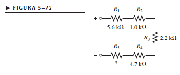

Rt = R1+R2+R3+R4+R5
17.4 k Ω = 5.6 k Ω + 1 k Ω + 2.2 k Ω + 4.7 k Ω + R5
R5 = (17.4-5.6-1-2.2-4.7) k Ω
R5 = 3.9 k Ω
17. En la figura 5-71, encuentre la resistencia total si los tres circuitos están conectados en serie.

Rt = (1+5.6+2.2+0.0047+0.01+0.012+0.001+1000+560+5600+680+10000) k Ω
Rt= 17848.82 k Ω
SECCIÓN 5–4 Aplicación de la ley de Ohm
19. ¿Cuál es la corriente presente en cada circuito de la figura 5-74?

a) I=V/Rt=(5.5 V)/(2.2+5.6+1)KΩ=0.625 mA
b) I=V/Rt=(16 V)/(1000+2200+560)KΩ=4.25*10^(-6)  A=4.25 uA

21. Se conectan tres resistores de 470 Ω en serie con una fuente de 48 V.
(a) ¿Cuál es la corriente en el circuito?
(b) ¿Cuál es el voltaje a través de cada resistor?
(c) ¿Cuál es el valor nominal de potencia de los resistores?
a) I=V/Rt=(48 V)/(3*470Ω)=0.034 A
b) V=I*R=0.034 A*470 Ω=16 V 
c) P=〖Vs〗^2/Rt=〖(48 V)〗^2/1410Ω=1.63 W

23. ¿Cuál es el valor de cada resistor mostrado en la figura 5-75?

R1=(21.7 V)/(65.8 mA)=329.78 Ω
R2=(14.5 V)/(65.8 mA)=220.36 Ω
R3=(6.58 V)/(65.8 mA)=100 Ω
R4=(30.9 V)/(65.8 mA)=469.6 Ω 
25. En el circuito de la figura 5-77, el medidor lee 7.84 mA cuando el interruptor está en la posición A.
(a) ¿Cuál es la resistencia de R4?
(b) ¿Cuál deberá ser la lectura del medidor en las posiciones B, C y D del interruptor?
(c) ¿Se fundirá un fusible de 1⁄4 A en cualquier posición del interruptor?

a) R4=Rt-R1-R2-R3
R4=(12 V)/(7.84 mA)-220Ω-470Ω-510Ω
R4=330.61 Ω
b) IB=(12 V)/(470 Ω +510 Ω+330.61 Ω)=9.15 mA
IC=(12 V)/(510 Ω+330.61 Ω)=14.27 mA
ID=(12 V)/(330.61 Ω)=36.29 Ω
c) No, el fusible no se fundirá en el recorrido A

SECCIÓN 5–5 Fuentes de voltaje en serie
27. Ayuda en serie es un término utilizado en ocasiones para describir fuentes de voltaje de la misma polaridad
en serie. Si una fuente de 5 V y otra de 9 V están conectadas de esta manera, ¿cuál es el voltaje
total?
Vt = 5 V+9 V = 14 V

29. Determine el voltaje de fuente total en cada circuito de la figura 5-79.

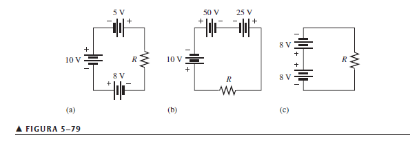

a) Las fuentes están conectadas hacia la misma polaridad,por lo tanto:
Vt=(10+5+8)V=23 V
b) La fuente de 25 V está conectada hacia polaridad diferente,por lo tanto:
Vt=(25-10-50)V=-35 V
c) Las dos fuentes proveen el mismo voltaje y están conectadas hacia diferente polaridad,por lo tanto,
el Voltaje es igual a 0 
31. Cinco resistores están dispuestos en serie con una fuente de 20 V. Las caídas de voltaje a través de cuatro
de los resistores son: 1.5 V, 5.5 V, 3 V, y 6 V. ¿Cuál es la caída de voltaje en el quinto resistor?
Vt=V1+V2+V3+V4+V5
V5=Vt-V1-V2-V3-V4
V5=(20-1.5-5.5-3-6)V=4V
33. En el circuito de la figura 5-81, determine la resistencia de R4.

(5.4 V)/(27 )=(4.4 V)/R4
R4=(27Ω*4.4 V)/(5.4 V)=22 Ω
35. Determine el voltaje a través de R5 para cada una de las posiciones del interruptor de la figura 5-83. La
corriente en cada posición es como sigue: A, 3.35 mA; B, 3.73 mA; C, 4.50 mA; D, 6.00 mA.

3.35 mA=(18 V)/(1800+1000+820+560+R5)Ω
3.35*10^(-3)  (4180)+3.35R5=18V
3.35*10^(-3)  R5=4
R5=1.19 KΩ

VA=3.35*10^(-3) A*1.19KΩ
VA=4 V
VB=3.73*10^(-3) A*1.19KΩ
VB=4.45 V
VC=4.5*10^(-3) A*1.19KΩ
VC=5.37 V
VD=6*10^(-3) A*1.19 KΩ
VD=7.16 V

37. La resistencia total de un circuito es de 560 Ω. ¿Qué porcentaje del voltaje total aparece a través de un
resistor de 27 Ω que forma parte de la resistencia total en serie?
V_x=(R_x/R_T ) V_T=((27 Ω)/(560 Ω)) V_T
V_T/(27/560 Vt)=(100%)/x
x=(27*100%)/560=4.82%

39. Determine el voltaje con respecto a tierra para las salidas A, B y C en la figura 5-85(a)
 
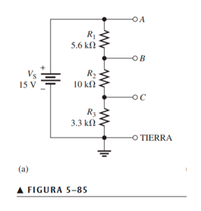

I=V/R=15/18,9KΩ= 0,8mA
Punto A 
V=I*R=0,8mA*18,9KΩ= 15V
Punto B
V=I*R=0,8mA*13,3KΩ=10,6V
Punto C
V=I*R=0,8mA*3,3KΩ=6,63V
*41. ¿Cuál es el voltaje a través de cada resistor mostrado en la figura 5-86? R es el resistor de valor más bajo, y todos los demás resistores son múltiplos de dicho valor como se indica.
 
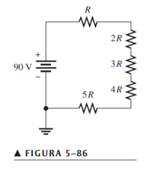

90V=X+2X+3X+4X+5X
90V=X (1+2+3+4+5)
90V/15=X
X=6
VR1=6V
VR2=12V
VR3=18V
VR4=24V
VR5=30V

43. Si hay 10 V a través de R1 en la figura 5-88, ¿cuál es el voltaje en cada uno de los demás resistores?

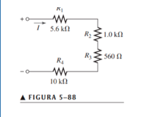

I=V/R= 10V/5,6KΩ= 1,78mA
VR2=I*R=1,78mA*1KΩ=1,78V
VR3= I*R=1,78mA*560Ω= 996,8mV=0,9968V=1V
VR4= I*R=1,78mA*10KΩ=17,8v
*45. Diseñe un divisor de voltaje variable para producir un voltaje de salida ajustable desde un mínimo de 10 V hasta un máximo de 100 V dentro del 1% con una fuente de 1 a 120 V. El voltaje máximo debe ocurrir en el ajuste de resistencia máxima del potenciómetro, y el voltaje mínimo debe ocurrir en el ajuste de resistencia mínima (cero). La corriente tiene que ser de 10 mA.

47. ¿Cuál es la potencia total en el circuito de la figura 5-88? Use los resultados del problema 43.

	

I= 1,78mA
V= 10 V + 1,78V + 1V + 17,8V = 30,58V
P=V*I= 1,78mA * 30,58V = 54,5mW
49. Encuentre RT en la figura 5-89.

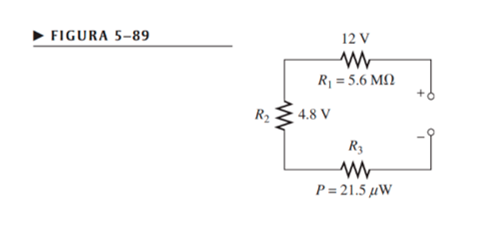
	
 
VR1=I*(R1)
I=VR1/R1=12V/5,6MΩ=2,14µA
R2=VR2/I=4,8V/2,14µA =2242990,654Ω
P=VR3*I
VR3=21,5µW/2,14µA =10,04V
R3=VR3/I=10,04V/2,14µA = 4691588,785Ω
RT=R1+R2+R3=5,6MΩ+2242990,654Ω +4691588,785Ω =12.5 MΩ
51. En la figura 5-90, determine el voltaje en cada punto con respecto a tierra.

I=V/R=100V/(5,6KΩ+5,6KΩ+1KΩ+1KΩ) =100V/13,2KΩ=7,57mA
VA=7,57mA*(5,6KΩ+5,6KΩ+1KΩ+1KΩ) =100V
VB=7,57mA*(5,6KΩ+1KΩ+1KΩ) =7,57mA*7,6KΩ=57.5V
VC=7,57mA*(1KΩ+1KΩ) =7,57mA*2KΩ=15,14V
VD=7,57mA*(1KΩ) =7,57V
53. En la figura 5-91, determine el voltaje en cada punto con respecto a tierra.

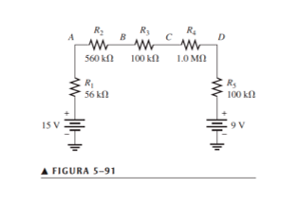

V=15V-9V=6V
RT=56KΩ+560KΩ+100KΩ+1MΩ+100KΩ=1816000Ω=1,816MΩ
I=V/R=6V/1,816MΩ=3,31µA
VA=(3,31µA) *(560KΩ+100KΩ+1MΩ+100KΩ) =5,8256V+9V=14,82V
VB=(3,31µA) *(100KΩ+1MΩ+100KΩ) =3,972V+9V=12,97V
VC=(3,31µA) *(1MΩ+100KΩ) =3,63V+9V=12,63V
VD=(3,31µA) *(100KΩ) =0,33V+9V=9,33V
55. Observe los medidores de la figura 5-92 y determine los tipos de fallas ocurridos en los circuitos y qué componentes fallaron

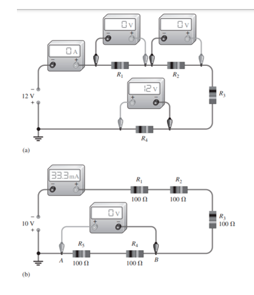

A)	Podríamos decir que el positivo de la fuente de alimentación esta directamente conectado a tierra por lo cual los electrones buscan el camino más fácil por ende no atraviesan por todo el circuito.  
B)	De igual manera logramos observar que esta directamente el positivo colocado a tierra además logramos ver en el multímetro un corto circuito ya que no marca el voltaje correcto.  
57. La tabla 5-1 muestra los resultados de mediciones de resistencia efectuadas en la tarjeta de circuito impreso que aparece en la figura 5-93. ¿Son correctos estos resultados? Si no, identifique los posibles problemas.
 

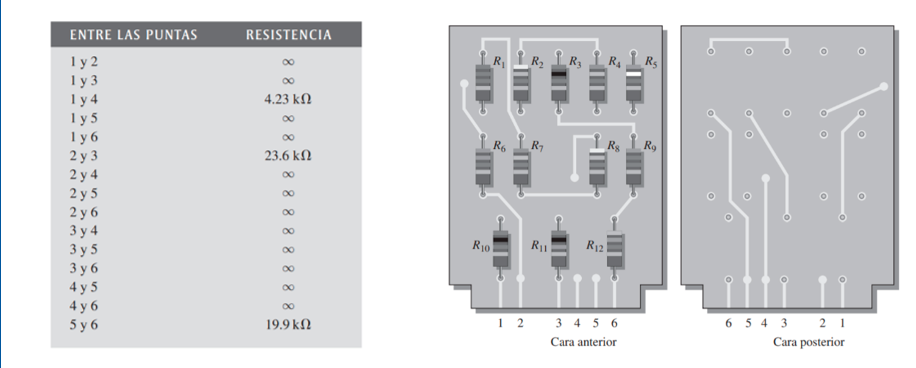

Logramos observar que los circuitos posiblemente algunos completan su trayectoria en serie por los cual no puede dar una medida como es el caso de los bornes con una equivalencia numérica en la tabla. 
*59. Al examinar la tarjeta de circuito impreso de la figura 5-93, se miden 17.83 kΩ entre las puntas 1 y 2. Asimismo, 13.6 kΩ entre las puntas 2 y 4. ¿Indica esto un problema en la tarjeta de circuito impreso? De ser así, identifíquelo
Logramos observar que el camino 1 termina en el camino 4 lo cual podremos decir que estos se cruzan y estaría provocando una toma de medida incorrecta.
Capítulo 6
1. Muestre cómo conectar los resistores de la figura 6-65(a) en paralelo entre las terminales de una batería

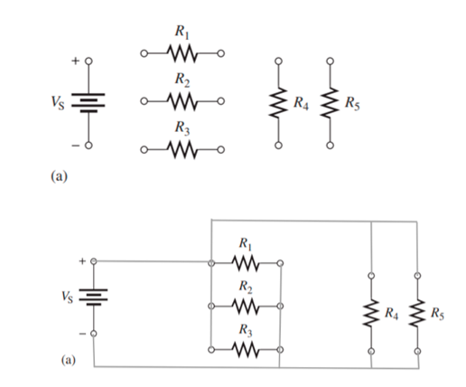

*3. Identifique los grupos de resistores que están en paralelo en la tarjeta de circuito impreso de doble cara mostrada en la figura 6-66.

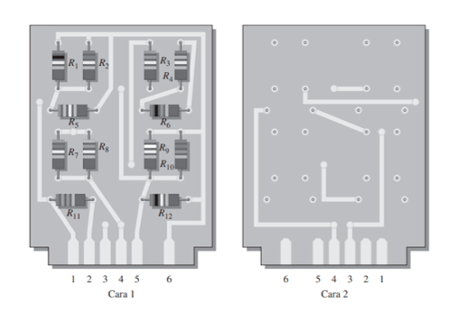

1) R1, R2, R5, R9, R10, y R12
2) R4, R6, R7, y R8
3) R3 y R11
5. El voltaje de fuente en la figura 6-67 es de 100 V. ¿Cuánto voltaje lee cada uno de los medidores?

Todas las resistencias se encuentran en paralelo por lo que los medidores de voltaje marcan 100v
7. ¿Cuál es el voltaje entre los extremos de cada resistor incluido en la figura 6-68 para cada posición del interruptor?

VA=15V Ya que la R1 y R4 están en paralelo
VB=15V Ya que la R1 y R3 están en paralelo (si la posición del interruptor está en b)

VC=15V Ya que la R1 y R2 están en paralelo (si la posición del interruptor está en c)

9. Se leen las siguientes corrientes en la misma dirección en un circuito de tres ramas en paralelo: 250 mA, 300 mA y 800 mA. ¿Cuál es el valor de la corriente que llega a la unión de las tres ramas?
IENTRADA=ISALIDA
IENTRADA= 250mA+300mA+800mA=1350mA= 1,35 A
11. En el circuito de la figura 6-69, determine la resistencia en R2, R3 y R4.

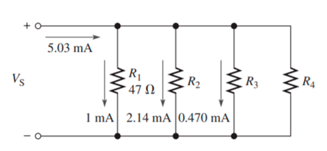

5,03mA=1mA+2,14mA+0,470mA+I4, I4=1,42mA
VR1+VR2=0, (2,14mA-1mA)47Ω+(2,14mA-0,470mA) R2=0, R2=22Ω
VR2+VR3=0, (0,470mA-2,14mA) 22Ω +(0,470mA-1,42mA) R3=0, R3= 100Ω
VR3+VR4=0, (I4-I3) 100Ω+I4*R4=0, (1,42mA-0,470mA) 100Ω+1,42mA*R4=0, R4=33Ω

13. La resistencia total de un circuito en paralelo es de 25Ω. ¿Cuál es la corriente a través de un resistor de 220 Ω que forma parte de este circuito si la corriente total es de 100 mA?
RTOTAL=25Ω
Ix =(RT/RX) IT, Ix=(25Ω/220Ω) 100 mA, Ix=0,0113A
I=11.4 mA

15.-Encuentre la resistencia total de cada uno de los siguientes grupos de resistores en paralelo:
a) 560 Ω y 1000 Ω

Req= 1/ (1/560+1/1000) = 358.9743 Ω

b) 47 Ω y 56 Ω

Req= 1/ (1/47+1/56) =  25.553 Ω

c) 1.5 kΩ, 2.2k Ω, 10 kΩ

Req= 1/(1/1.5k+1/2.2k+1/10k) = 0.8188 kΩ

d) 1 MΩ, 470 kΩ, 1kΩ, 2.7 MΩ

Req= 1/(1/1M+1/470k+1/1k+1/2.7M) = 730.28 kΩ

17.- ¿Cuál es la resistencia total de doce resistores de 6.8 kΩ dispuestos en paralelo?

RT=12/(1/6.8)= 81.6kΩ

19.- Encuentre la resistencia total de todo el circuito en paralelo descrito en el problema 18.
RT=1/((5/(1/470))+(12/(1/100))
RT= 0.2816 kΩ
21.- ¿Cuál es la resistencia total entre el punto A y tierra en la figura 6-72 en las siguientes condiciones?

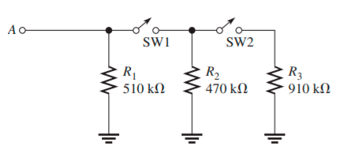

(a) SW1 y SW2 abiertos

 RT=1/(1/510k)= 510kΩ

(b) SW1 cerrado, SW2 abierto

RT=1/(1/510K + 1/470K) = 244.59 KΩ

(c) SW1 abierto, SW2 cerrado 

RT=1/(1/510k)= 510kΩ

(d) SW1 y SW2 cerrados

RT=1/(1/510k + 1/470k + 1/910k)= 192.77 kΩ

23.- Tres resistores de 33Ω están conectados en paralelo con una fuente de 110 V. ¿Cuál es la corriente suministrada por la fuente?
RT=3/(1/33)= 99Ω
I=110/99= 1.1111 A

25.- Muchos tipos de luces decorativas están conectados en paralelo. Si se conecta un juego de luces a una fuente de 110 V y si la resistencia en caliente del filamento de cada foco es de 2.2kΩ, ¿cuál es la corriente a través de cada foco? ¿Por qué es mejor tener estos focos en paralelo y no en serie?

La corriente dependerá de el numero de focos conectados por lo que la corriente se disipará o se divide en cada uno de los focos por lo tanto sería una corriente muy baja en cada uno.
I=110/2.2k= 50mA se dividirá en todos los focos, por lo tanto, esta se usa en paralelo para que todos los focos tengan la misma cantidad de voltaje o energía para encenderse por otro lado si lo conectamos en serie existe una caída de tensión o un bajo voltaje hasta llegar al último foco.

27.- ¿A qué valor mínimo se puede ajustar el reóstato de 100 Æ mostrado en la figura 6-75 antes de que el fusible de 0.5 A se funda?

RT=15/0.5=30Ω
Si el reóstato baja mas de los 30Ω el fusible se fundirá, porque alcanza niveles de corriente elevados a 0.5 A.

29.- Encuentre los valores de las cantidades no especificadas en la figura 6-77.

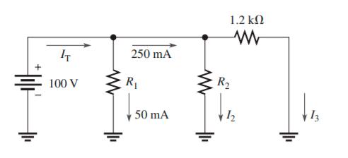

Req1=100/250mA= 0.4k Ω
1/0.4k=1/1.2k + 1/R2
R2=0.6k
I2=100/0.6k= 166.66mA
I3=100/1.2k= 83.33mA
R1=100/50m= 2 kΩ
RT=1/(1/2k + 1/0.6k + 1/1.2k)
RT=0.333 kΩ
IT=100/0.333k= 300mA

31.- Determine la corriente a través del resistor para cada una de las posiciones de interruptor calibradas en la figura 6-79.

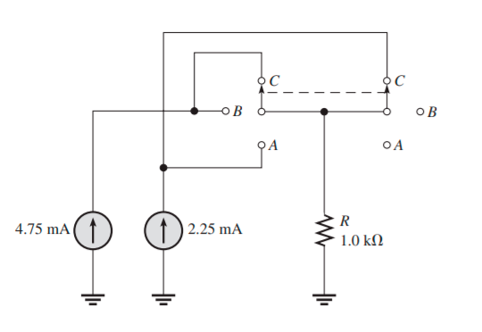

Cuando esta la posición: 
C-C la resistencia tiene 8mA
B-B la resistencia tiene 4.75mA
A-A la resistencia tiene 2.25mA

33.- Determine la corriente en cada uno de los divisores de corriente mostrados en la figura 6-81.

Circuito 1
IR2=(R2/R1+R2)
IR2=(2.2M/1+2.2)*10µA= 6.8kΩ
IR1=(1/2.2+1)*10 µA= 3.125kΩ
RT=1/(1/2.2M + 1/1M)= 0.68 MΩ
Circuito 2
IR1=(2.2K/1+2.2)*10mA= 6.8Ω
IR2=(1/1+2.2)*10mA= 3.123Ω
IR3=(3.3/3.3+6.8)*10mA= 3.2673Ω
IR4=(6.8/3.3+6.8)*10mA= 6.7326Ω
RT=1/(1/1k + ½.2k + 1/3.3k + 1/6.8)=0.5250 kΩ

35.- Determine todos los valores de resistor en la figura 6-83. RT=773 Ω

RT=773 Ω
Vs=0.01553A*773Ω =12 V
I3=2.14mA
R1=12/3.64=3.2 kΩ
R2=12/6.67= 1.79 kΩ
R3=12/2.14= 5.60 kΩ
R4=12/3.08= 3.89 kΩ
 37.- En el mercado están disponibles resistores en derivación especialmente diseñados para detectar caídas de voltaje de 50 mV en aplicaciones de medición de corrientes altas. Se conecta un voltímetro de 50 mV, 10 kΩ de escala completa entre la derivación para realizar la medición. 
(a) ¿Qué valor de resistencia en derivación se requiere para utilizar un medidor de 50 mV en una aplicación de medición de 50 A? 
R=0.050V/50A =1kΩ
(b) ¿Cuánta corriente circula por el medidor?
I=50/10= 5 A

39.- Determine la potencia total en cada uno de los circuitos de la figura 6-81.
Circuito 1:
P=(10)^2* 680 =68000W

Circuito 2: 
P=(10)^2*0.5250= 52.5 W

41.- Encuentre los valores de las cantidades no especificadas en la figura 6-84.
2=(0.2^2)*RT
RT=2/0.04= 50Ω
Vs=0.2*50= 10V
0.75=10^2/R2
R2=100/0.75=133.33Ω
IR2=10/133.33=0.075 A
R1=83.33

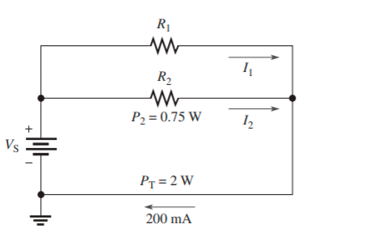

43.- Si en el problema 40 se funde uno de los focos, ¿cuánta corriente circulará a través de cada foco restante? ¿Cuál será la corriente total?
Vs=110V
P_foco= 75W
I=75/110= 0.68 A
5*0.68= 3.40 A para el circuito total

45.- ¿Qué está mal con el circuito de la figura 6-86?
La medición de corriente total no es 7.82mA si no 10.86mA por lo tanto no da una corriente errónea

47.- Desarrolle un procedimiento de prueba para revisar la tarjeta de circuito mostrada en la figura 6-87 y asegurarse de que no hay componentes abiertos. Debe realizar esta prueba sin quitar el componente de la tarjeta. Describa el procedimiento en un formato detallado paso a paso.
Iniciamos midiendo el voltaje que circulo en las resistencias R1 y R2 para después medir la corriente que sale, poniendo el punto común en el pin 1 y medir hasta el pin 2, y la corriente seria del final de la resistencia dos con el pin 2.
Para la siguiente estructura su voltaje seria desde el pin 4 hasta el pin 3 y la corriente desde el final de la resistencia 3 y al pin 3.
Para la última estructura seria de medir el voltaje desde el pin 5 al pin 6,  y su corriente desde el final de la resistencia 8 al pin 6.

49. Para el circuito mostrado en la figura 6-88, determine la resistencia entre las siguientes puntas si existe un corto entre las puntas 3 y 4:
(a) 1 y 2 
Valor de resistencia= 0
(b) 2 y 3 
Es la suma de las resistencias R5, R6, R7, R8, R9, R10 de forma que estas están en paralelo.
(c) 2 y 4 
Su valor de resistencia es cero
(d) 1 y 4
Es la suma en paralelo de las resistencias R1, R2, R3, R4, R11, R12.

4)Video

5)Conclusiones

-Se analizaron los circuitos en serie, con uso de las leyes de Ohm y Kirchhoff, así se lograron resolver los problemas en circuitos eléctricos.

- El calculo de los circuitos mixtos y sus distintos elementos, se simplifica con el divisor de voltaje o corriente, las cuales son formulas para encontrar la intensidad y voltaje mediante otras variables.

- Realizamos los ejercicios propuestos del libro lo cuál aplicamos la ley de Kirchhoff en los circuitos serie y paralelo para calcular lo propuesto en dicha pregunta.

6)Bibliografia

Floyd, T. (2007). Voltaje, corriente y resistencia. En L. M. Cruz Castillo (Ed.), Principios de Circuitos Eléctricos (VIII ed., pp. 16-71). Pearson Educación. Floyd, T. (2007). Cantidades y unidades. En L. M. Cruz Castillo (Ed.), Principios de Circuitos Eléctricos (VIII ed., pp. 1-15). Pearson Educación Abreu, R. (2005). Fuentes de alimentación conmutadas. El1313-Electrónica III 2005, 4,5. http://www.el.bqto.unexpo.edu.ve/rabreu/Electronica3/Clase9.pdf

